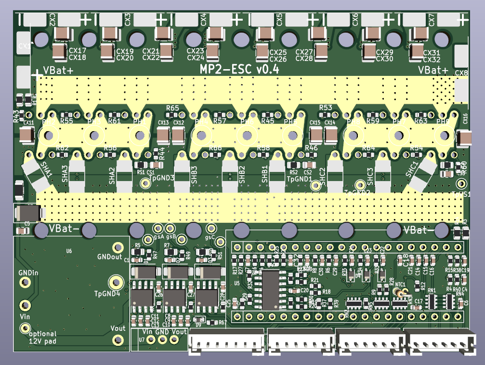
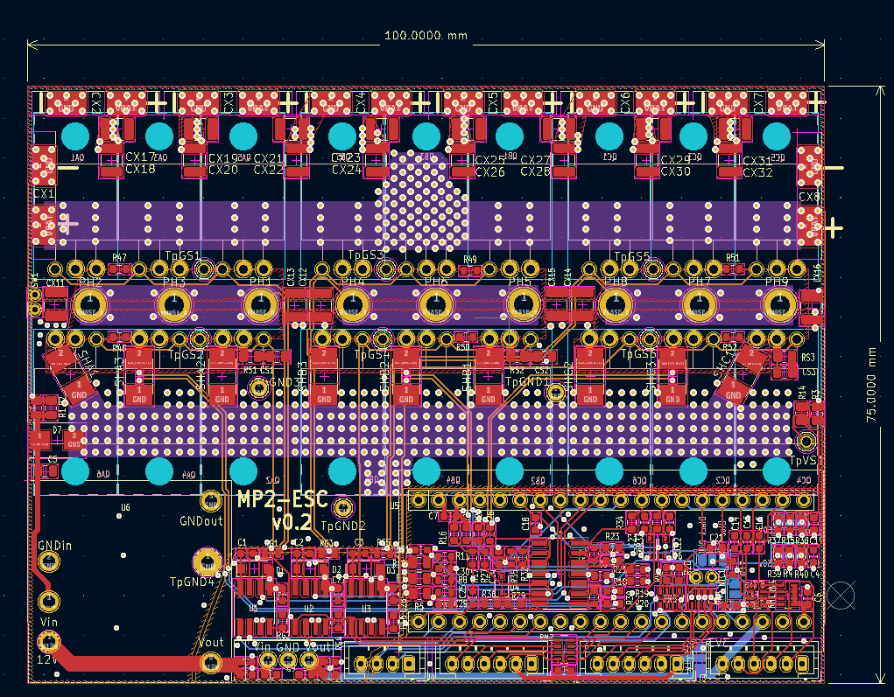

# **MP2_ESC** 
Multi-Platform, Modular, Powerful Electronic Speed Control

## Design Goals
**Decent power** (18 FET, so 100-300A should be possible depeding of FET choice, Bus Bars, and cooling) \
**Relatively compact design**, fitting for ebikes / medium-large electric scooters, and cheap to order \
**Modular**, with easily replaceable modules (both bluepill and blackpill compatible hardware wise, 12V and 5V DC-DC stages are modules also) \
**Standard footprint parts**, so replacement parts can be found easily in case of original parts out of stock or out of production \
**Optimized for low cost** production by JLCPCB, including SMT assembly.  \
**Possibility to buy the SMD parts pre-soldered:** All SMDs are on the same side, in large stock at lcsc (at the time of writing), so the board can be ordered with SMDs pre-assembled by JLCPCB for a decent price. \
**To our knowledge, features that are not available on most open source ESCs:**
* hardware overcurrent proection (triggers at 430A)
* hardware overvoltage protection which triggers at:
  * 75.6V for the 80V setup
  * 92.6V for the 100V setup
  * 137V for the 150V setup

## Compatibility with variaty of Open-Source VESC projects
VESC with [ STM32F405 pill ](https://github.com/davidmolony/F405_pill)  \
VESC with GD32F303CG pill (Netzpfuscher mod, note CG) \
EBICS with F103 Bluepill (Stancecoke) \
[SmartESC V3 (Casainho)](https://github.com/casainho/SmartESC_STM32_v3) \
[SmartESC V2 (Netzpfuscher/Koxx3)](https://github.com/Koxx3/SmartESC_STM32_v2) \
MESC with F401 Blackpill (MxlemmingFOC) \
STM32 Motor Control Workbench (F401, F103)

## PCB

## Required software
The circuit design tool used for this project: [KiCad](https://www.kicad.org/).

## Endless Sphere Thread:
https://endless-sphere.com/forums/viewtopic.php?t=117045

## Building Tips:

Some soldering, assembly, and testing are [here](docs/PCB_ASSEMBLY_TESTING.md).

### **Bus Bars**
Bus bars are recommended for anything else than very low current. (extra copper wires/bars/plates soldered to the exposed copper strips of the PCB, or at very least a ton of solder on the exposed strips, but this last variant only for low phase currents). See [this document](docs/HIGHER_AMP_ASSEMBLY.md) for examples. 

### **Bulk electrolytic capacitors (XC.... )**
We recommend a total of 2000uF for low phase currents (up to ~150A) and 3000uF or more for high battery currents. There are 2 smt pads at the ends of the Vbat bus bar, and another 6 on the top for usecases where a lot of capacitance is needed.
General considerations: You need more capacitance the more phase current you plan to use, and the longer (and thinner) your battery wires are. So you can probably also get away with less if you have short thick battery wires.  

Choose voltage rating ~ 1.5x your max battery voltage for a long lifetime. For 48v nominal (54.6V max) battery voltage, 80V or more is recommended. Or just use the same rating as your FETs.  
The total capacitance of the electrolytic capacitors is more important than the exact combination of values. More smaller capacitors probably have a slight advantage over fewer large ones: lower ESR, lower parasitic inductance, and redundancy in case of failures.

### **Bulk ceramic/MLC capacitors:  (XC.... )**
As much as possible. These need to compensate for the high frequency weakness of the electrolytic capacitors. Overrating voltage rating is recommended. 

### **Capacitors - the rest**
Values are consolidated for easy buying. Voltage rating is 25V or higher regardless if they are on the 12v, 5v, or 3v3 rail on the default design, however you can choose a smaller voltage rating for the 5v and 3v3 rails..  

### **Snubbers (RSx, CSx)**
These are RC snubbers. **They are here only for the footprints. Do not fit them (yet).** The real values (if necessary at all) will be computed after we build the controller and see what ringing we get. Purpose of the snubbers is to dampen that ringing. (if you choose different parts than the one we compute the snubbers for, you might need to compute the snubbers yourself). These components are not present in the pick-and-place or BOM files.

### **MOSFETs**
The default MOSFETs are available from lcsc at the time of writing. They are cheap and have good specs. (low Rds on, low Crss, 100v, etc). 
You can use a FET of your choosing, but please be aware that old FETS (such as the famous 4110 or 3077) have huge Crss, leading to a tiny Ciss/Crss ratio. This ratio needs to be bigger than roughly your max battery voltage, so you will need to compute and add the optional Cgs capacitors (OCx). Small Ciss/Crss results in ringing / parastic turn on (which leads to failure). 
That being said, it’s best to just use FETs with Ciss/Crss > ~100, nowadays they’re easy to find. See the section with alternative parts below.

Some additional material on MOSFET selection and testing is [here](docs/MOSFET_PARAMETERS.md).

Attach the FETs to a heatsink: the FETs need to be electrically isolated from the heatsink, but well connected thermally. The options for this are:
* Mica glass (“traditional option”, cheap, easy to find)
* Ceramics (saw this as a new option, never tried it)
* Polymer pads 
* Kapton Tape 

Unfortunately in focusing on making the board small we crammed the FETs very close together. This means some mica or ceramic pads will not fit - and it’s very hard to cut them afaik. So for this version we’re probably stuck with polymer / kapton. 

### **Board Testing**

* V0.1 build has been tested by mxlemming with MESC FOC firmware on F401CC black pill board, and by Netzpfuscher with his VESC port, in lab conditions. 
* V0.3 has been tested, and reached 280Phase amps on a Surron, with maximum power draw 10kW. There were no overheating problems (though cooling was good, and it was winter). Over 280 Phase amps there were random BRK errors (a fix is being tested)

### **Known issues/limitations:**
* Pills have very few ADCs, so some sacrifices have been made (choice between analog brake and Motor Temp). 
* Gate drivers are not as popular and readily available on lcsc as the other SMD parts
* Having the MCU on a separate board (the "pill" development boards) is a questionable idea from PCB design point of view. In our testing it seemed to work, but we know it's not without drawbacks (main one being pill pins "catch" noise).

## Alternative parts.

### **MOSFETs**
100V: 
* CRST030N10N - Default, cheap, tested, available at lcsc.
* MDP10N027 - Cheap, tested, available on aliexpress.
* IPP023N10N5 - Good, more expensive, not tested.

80V: 
* CRST030N10N - Very cheap, not tested, lcsc.
* IPP019N08NF2S - Good, more expensive, not tested
* IPP016N08NF2S - Very good, more expensive, not tested

150V:
* CRST073N15N
* NCEP15T14
* NTP5D0N15MC - best of the 3 listed here, not tested. 

Generally: There are a lot of TO220 fets to choose from (probably the only real advantage of TO220). If you want another, make sure it has low RDSon, gate charge <= 170nC, low Crss (Ciss/Crss > Vbat).  

### **Gate Drivers**
* TF2190M-TAH (TFSS) (LCSC PN: C2917161) -> Default. tested.
* NCP5183/NCV5183 (On Semi)
* FAN7390 (Fairchild)
* FAN7191 (Fairchild)
* DGD2190M (Diodes Inc)
or any other "replica" of IR2181

### **Operational Amplifier**
* NCS20034 (On Semi) - tested
* GS8634-SR (Gainsil)
* COS724SR (Cosine) - tested. current default recomendation due to specs and LCSC stock
* TSV914 (ST)
* TLV9054 (TI)

### **Pills**
* F405 Pill - [ LINK ](https://github.com/davidmolony/F405_pill) 
* Black Pill
* Blue Pill

### **12V DCDC**
* We recommend isolated:
  * PQDE6W-Q110-S12-D preferred (CUI devices)
  * RD5-110S12W (Rui Da Kang)
  * HLK-10D11012 (HiLink)
  * RDE20110S12 (XP Power)
  * THN 10-7212WIR (TRACO Power)
* Less desireable: unisolated
  * P7805-500 (CUI)
  * Or wire on some [random cheap stuff](https://www.aliexpress.com/item/1005001599313771.html)

### **5V DCDC**
* Tons of options in "TO220 Replacement" format - like [ this random example ](https://www.aliexpress.com/item/1005004807082011.html)
* VXO7805-500 (CUI)
* VX7805-500
* 7805SR-C (Murata)

### **Diodes for "over" protection**
1N5819WS - These are ubiquitous, but it is important you use these due to very low forward voltage. Using anything else will probably result in hardware overcurrent not working.

### **Diodes for bootstrap**
We recently changed from XX4007 in SOD123 package to higher speed diode (US1M). Anything with 100V+ or 150V+ will work... but generally many 1kV diodes are available in common packages, so use them. High speed are preferable, but really most diodes will work...

## Supporting materials
* Gathering motor parameters [[LINK](docs/MOTOR_PARAM.md)]
* MOSFET selection [[LINK](docs/MOSFET_PARAMETERS.md)]
* Pin mappings between MP2 and the F405 pill [[LINK](docs/MP2_F405PILL_PINOUTS.md)]
* MP2 assembly, testing and firmware [[LINK](docs/PCB_ASSEMBLY_TESTING.md)]
* MP2 bus bar methods [[LINK](docs/HIGHER_AMP_ASSEMBLY.md)]
* MESC Firmware on the MP2 -- getting started with STM32CubeIDE [[LINK](docs/FIRMWARE_INTRO.md)]
* Some (bad) examples of connecting the MP2 to a motor [[LINK](docs/QS165_MP2_WIRING.md)]

## Change Log / Known Problems 

### V0.4 Wish list (V0.3 known problems). 
* remove vbat solder jumpers. for 150v the board requires a different BOM anyway.
* make overlimit opamp output LPF better suited to an additional LPF on the pill and reducing pin noise. (cap -> 10uF, move it near pin, decrease R value)
* make power switch footprint more accessible. (bigger, better location)
* move the protective R pair near vbat ("before" the switch)
* increase margins for Vbat and Phase copper areas to reduce short / arc risk
* replace the 4pin JST with a 6pin one and route the last 2 unrouted useful pill pins to the 2 extra JST pins. (requires quite some PCB redesign)
* standardize JST pin layout (GND and Vaux are all over the place.)
* add a power led on 5v rail

### V0.3 change log
* reduced shunt value to 0.5mR (from 1mR) for lower heat generation
* increased opamp gain to ~22 (from 10) for compensating lower shunt value
* added solder jumpers for configuring power stage vsense
* faster/better bootstrap diodes for better behavior and lower Qrr loss/heat
* many other tiny changes / improvements

## FAQ

* **What’s with the many solder jumpers?**
We made a few things hardware configurable. 1) Vsense and Overvoltage Protection optimized for 80 / 100 / 150V power stage, Voltage for peripherals can be set to 5 or 3.3V, Motor Temp vs Brake signal compromise, and of course, changing the wiring to acommodate the bluepill or blackpill pinouts (which vary slightly)

* **Why do the electrolytic caps have surface pads instead of through hole?**
Through hole pads imply a lead through the hole, sticking out on the other side. This would prevent the FETs from sitting flush against the PCB.

* **What is the empty footprint for D8?**
Its a footprint for a TVS diode as replacement for D7. You would want to solder a TVS there if you use a different voltage than 20s and D7 is inappropriate. Of course you can populate D7 with a different TVS during fabrication, but D8 pads are easy to hand-solder after the fact. 

* **Can you assemble it for me?**
There is no plan on selling any assembled PCBs. You can get the SMD side pre-assembled at [jlcpcb](https://jlcpcb.com/) (at the time of design all parts were in stock for jlcpcb SMT service). So you’ll only need to solder the through-hole parts and the modules. 

* **I want more power!!!**
This might not go well. So good luck, you’ll probably need it. Please don't blame us when it goes up in smoke. But do let us know how it goes. Disclamer aside, here are some basic suggestions:
   * Review what [other people](docs/HIGHER_AMP_ASSEMBLY.md) have done.
   * Add thick copper bus bars to the board.
   * Add more/ bigger bulk caps!
   * Use appropriate wires (thick!) 
   * Overcurrent trips at 430A. If you want to come close to it / exceed it, either cut off  the overcurrent circuit by desoldering D4, D5, D6, or be creative with the shunts. But 150A per TO220 fet is a crazy idea.

* **I want more voltage!!!!**
Realistic limit is 30s lipo for 150V rated components. For more than that the ESC will need serious redesign. 

* **Your part X is bad, I recommend Y!**
We tried to find cheap but decent parts for this controller. Cheap almost always implies a compromise in some other areas, so you might not like our pick :)
It should be fairly easy to switch to other parts on your own: we used mostly standard and popular footprints and packages
If you know better parts or have better solutions, please let us know on our ES thread. We like learning new things. 
....except if you’re going to suggest 3077 or 4110 mosfets. Those things are dinosaurs. They were the biggest baddest thing around during their time, but nowadays belong in a museum. Or on a t-shirt. Please stop recommending them. 

* **Where can I buy parts?**
Lcsc.com, mouser.com. Aliexpress if needed. 
We designed this with jlcpcb smt assembly in mind, so all SMDs were in stock at lcsc when I designed the PCB. Also most of the Through-hole parts. 

* **Why do the battery wires go in seemingly random places in the middle of the board?**
If you have the battery wires at the edge, then the full battery current will need to go through a portion of the battery “traces” of the PCB. I’ve placed them near the middle switch node, so with a tiny exception, the current through the traces is ⅓ of the battery current. 

* **This whole thing is amateur work!**
Yeah, totally true. We are mostly amateurs working on a generic ESC for free. If by this you refer to any specific mistake / set of mistakes, we would love to know about it! Post in the ES thread. Thanks!
