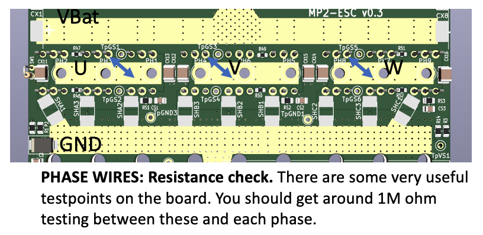

# MP2 Assembly and Testing

## MP2 PCB assembly
The following is not a step by step guide for finishing the MP2 but it still may be useful for people putting together their first PCB. 

Note: in this assembly we have not added any extra copper along the bus bars which is a common practice to increase the total amount of amperage used for these boards. Adding thicker bus bars will be the subject of another tutorial. 

There are MANY tutorials on how to solder and hopefully this is not your first rodeo. At a minimum you are going to need a high wattage soldering iron, decent quality solder, hopefully some flux remover and a multimeter to be able solder this board. 

Looking at the top side of the board, it tends to be easiest to solder in the shorter parts first (so they rest flat on the bench when getting soldered in. So a possible order is:
* JST connectors
* 12V to 5V DC-DC converter
* the larger 12V DC-DC converter
* 20 pin headers

When doing the 20 pin headers...

Another suggestion:

The 12V-5V DC converter sits funny:

Heat shrink tubing is your friend!

Use precision:

**NOTE:** These pics are included to talk about soldering issues, **BUT BE ADVISED** We strongly recommend users take advantage of the three holes on each phase to solder in larger wires and get improved current sharing with the MOSFETs. Take a look at [THIS FUTURE DOCUMENTATION] for higher amperage connections. 

## MP2 continuity testing
Before you're finished with soldering be sure to do some important testing of your board. One set of tests involved using a continuity checker on your multimeter. This is a **short video** to help you get started:

Once your set up for testing run through the following tests:

## MP2 resistance testing
Since you have your multimeter out there are some other useful measurements to take. These tests can vary based on what type of meter you have. Also sometimes the readings will take a while to settle down to the final value.

## MP2 powering up

## MP2 powering up

Hopefully you have experience powering up a PCB for the first time. 

Here a subset of things you can do when testing the MP2 for the first time.

* Remove the pill from the MP for this testing
* Connect your multimeter to GND
* Apply power to VBat
* Note that in some cases the DC-DC converter wont activate at <42 volts
* Test the points circled on the figure below

