# MP2 Assembly and Testing

## MP2 PCB assembly
The following is not a step by step guide for finishing the MP2 but it still may be useful for people putting together their first MP2. 

There are MANY tutorials on how to solder and hopefully this is not your first rodeo. At a minimum you are going to need a high wattage soldering iron, decent quality solder, hopefully some flux remover and a multimeter to be able solder this board. 

Looking at the top side of the board, it tends to be easiest to solder in the shorter parts first (so they rest flat on the bench when getting soldered in. So a possible order is:
-JST connectors
-12V to 5V DC-DC converter
-the larger 12V DC-DC converter
-20 pin headers

When doing the 20 pin headers...

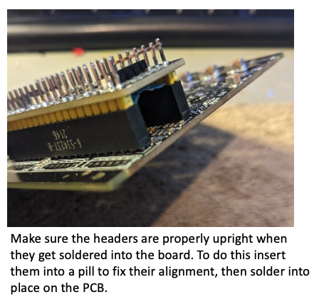
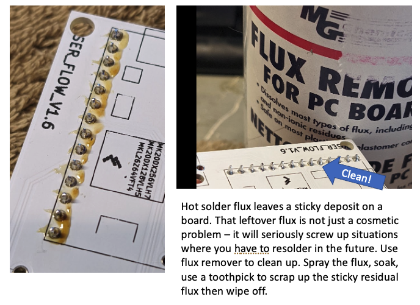
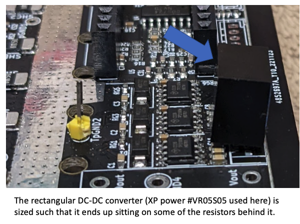
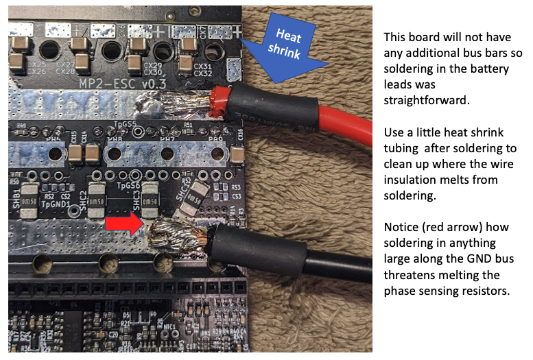
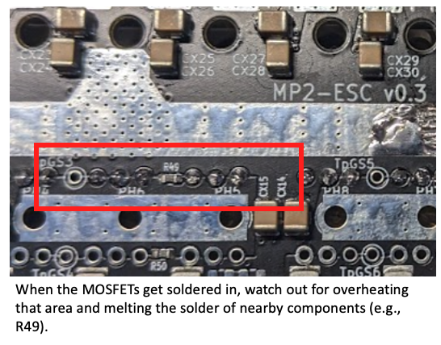
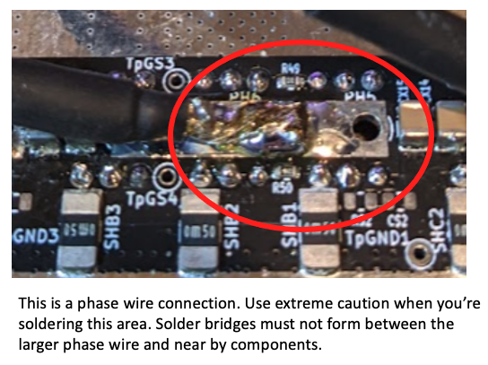
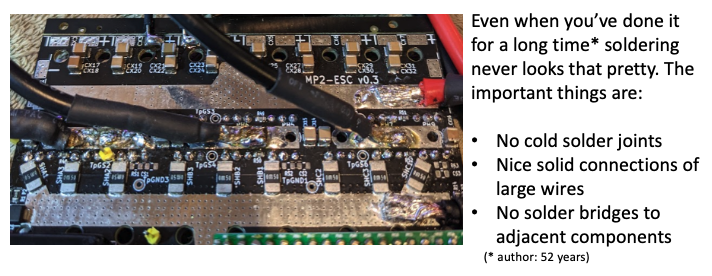

## MP2 testing
Before you're finished with soldering be sure to do some important testing of your board. One set of tests involved using a continuity checker on your multimeter. This is a short video to help you get started:

Once your set up for testing run through the following tests:

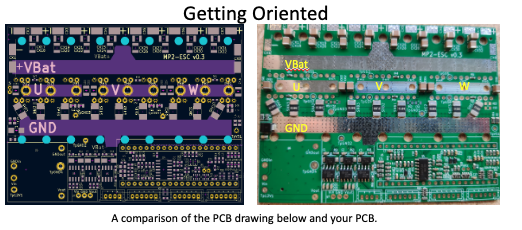

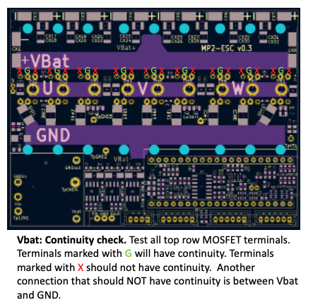

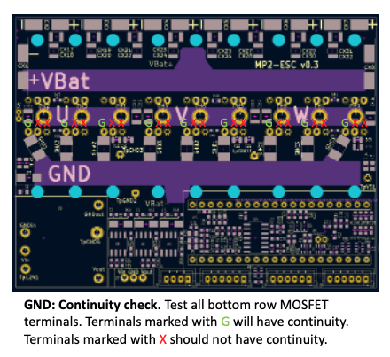

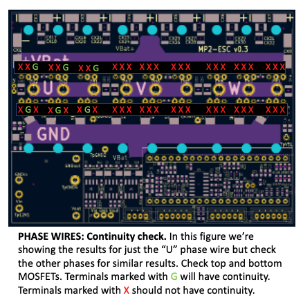

